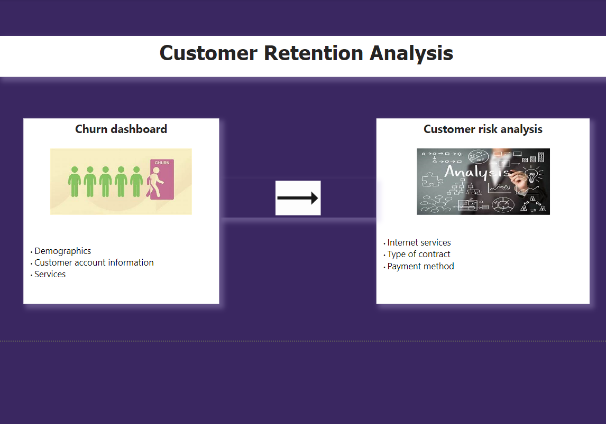
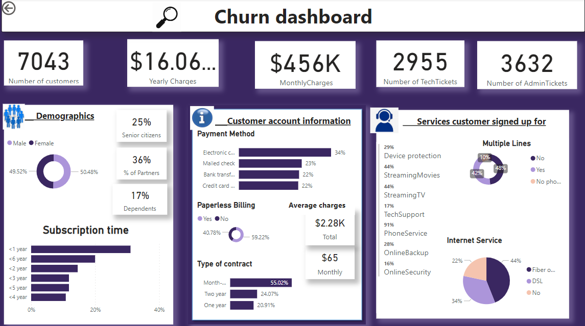

# Customer Retention Analysis (Power BI Project)

 

## Introduction
---

This is a Power BI project for a Telecom company.This project is to analyze and derive insights for a client to make data driven decisions by providing well designed Power BI dashboard visualising the necessary KPIs and metrics.The telecom company doesn't want to lose more customers but instead know more about customers and get them back and even a possibility of new customers.

**_Disclaimer_**  :  _The Churn dataset was provided by PwC company during the job simulation program that l participated in._

## Problem statement
---

1.	What is causing churn in the company?
2.	How much does churn affects the company?
3.	How are the customers interacting with the company?
   

## Skills/concepts demonstrated
---

The following Power BI features were incorporated:
-	quick measures,
-	data transformation,
-	filters,
-	slicers,
-	gauge,line charts,bar charts and cards.

## Visualization
---

The report comprises of 3 pages
1.	Welcome
2.	Churn dashboard
3.	Customer risk analysis

You can interact with the **Report** [here](https://app.fabric.microsoft.com/groups/me/reports/9d196471-6c0b-418f-b8af-2153aff0442f/ReportSection57e2f73ce40be00019dc?experience=power-bi)

## Analysis:
---

   

The **welcome dashboard** is showing two other pages that are in this report namely Churn dashboard (which will look into information about demographics of the customers,customer account and services used by the customers) and Customer risk analysis (This dashboard reports on the analysis made about churn in relation to internet services,type of contract and payment method offered by the telecom company).When you click on these images it will take you to the respective page.

Out of 7043 customers aproximately 50% are women ,25% senior citizens, 36% are partners and 17% dependents.Most of the customers are subscribing less than a year and they churn.Paperless billing and electronic cards are more popular.Customers prefer month to month type of contacts maybe because  of the uncertanity of services provided by the company thereby having the lowwest number of customers on a one year contract.Most famous services signed up by customers are the phone service and streaming TV with 42% of customers having multiple lines.Customers opt for Fiber optic to DSL.

The churn rate is 27% which is not too bad but still high.As noted befor a lot of people opt for fiber optic type of internet service and as shown above the amount for monthly charges is the highest which is one reason customers are churning most probably to other companies in search for lower monthly charge rates. 

## Conclusion and Recommendation
- The company should segment and target customers based on demographics and preferences including gender and service preferences. Tailor marketing messages and 
  offers specifically to female customers for example who opt for fiber optic services, highlighting to them value and benefits of the service to meet their needs.
- l would also recommend the company to review pricing strategies and consider offering flexible pricing plans or discounts for fiber optic services to make them 
  more affordable for customers, particularly female,independent and senior citizens customers who may be sensitive to price.
